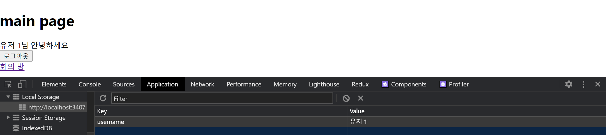
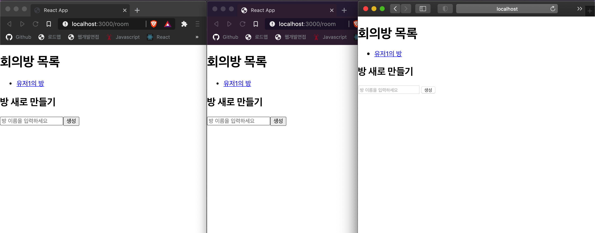
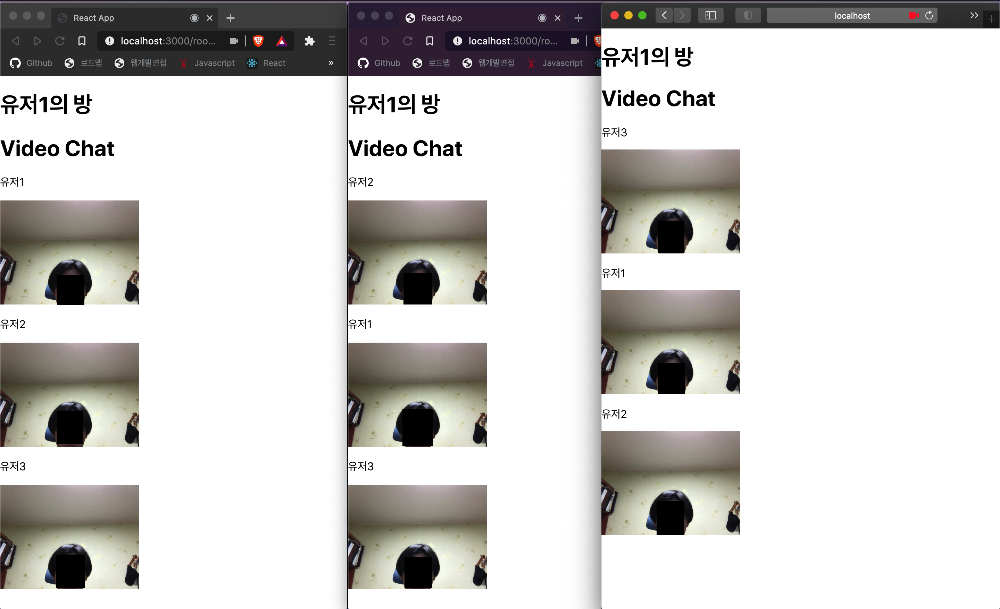

# WebRTC_WebApp

2020-2학기 개별연구 - 언택트 환경을 위한 WebRTC 기반 화상 컨퍼런스 콜 기술 연구

## 1. 동기 및 개발 목표

- 최근 COVID-19의 발발로 인해 언택트와 비대면이라는 키워드가 급 부상하고 있다. 이러한 상황 속에서 학교 수업이나 회사의 회의 등을 화상 프로그램을 사용하여 진행하는 일이 잦아지고 있다.
- 별도의 플러그인을 사용하지 않고도 브라우저간 화상 Call이 가능한 WebRTC 기술을 연구하고 그 기술을 활용해 프로그램을 개발하는 것을 목표로 한다.

## 2. 최종 결과물 소개

- 프론트 엔드 : React.js를 사용하여 제작하였으며, 간단한 사용자 등록, 화상 회의 방 등록이 가능하므로 같은 회의 방에 들어가는 경우 그 인원끼리 다중 화상 회의가 가능하다.
- 백 엔드 : Node.js, 그 중에서도 Express를 사용해서 Peer간 통신을 중개하는 중개 서버를 개발했다.

## 3. 프로젝트 추진 내용

- WebRTC의 동작 방식 및 사용 가능한 API에 대한 조사 및 사용법에 대한 공부가 우선적으로 이루어졌다. 다음으로 프론트엔드와 웹소켓 통신을 하는 중개 서버를 Express를 사용해 제작했다. 이후에 React.js를 사용한 웹 프론트엔드와 기본적인 사용자 등록 및 화상 회의 방 등록과 같은 사전 기능을 구현하였으며 최종적으로 WebRTC의 getUserMedia와 RTCPeerConnecion API를 사용해 화상 회의를 실질적으로 구현하였다.

## 4. 기대 효과

- 언택트 시대에 걸맞는 비대면 화상 회의를 가능하게 한다.
- 별다른 플러그인이나 제3의 프로그램을 설치하지 않고도 간단하게 웹페이지 접속을 통해 서비스를 이용할 수 있다.

## 5. 관련 연구

### 5.1 WebRTC

WebRTC(Web Real-Time Communication) 기술에 대한 정의를 찾아보자면, 웹 어플리케이션과 사이트가 중간자없이 브라우저 간에 오디오나 영상 미디어를 포착하고 마음대로 스트림할 뿐 아니라, 임의의 데이터도 교환할 수 있도록 하는 기술이다. WebRTC를 사용하게 되면 플래시와 같은 외부 플러그인이나 제 3자 소프트웨어를 설치하지 않더라도 Peer간의 데이터 공유와 화상 회의를 구현할 수 있다. WebRTC에서는 통신을 구현하기 위한 여러 API(Application Programming Interface)들을 제공하는데, 그 중에서 다중 화상 서비스 구현을 위해 필요한 API를 정리해보자면 유저의 MediaStream(웹캠을 통해 불러오는 영상 혹은 마이크를 통해 불러오는 음성 데이터)를 불러올 수 있는 getUserMedia API와 클라이언트들이 서로 통신하기 위해서 중개 서버를 통해 정보를 주고받는 데 사용되는 RTCPeerConnection API가 있다.

### 5.2 getUserMedia API

별다른 플러그인이나 외부 프로그램의 사용 없이 바로 구현 가능하다는 WebRTC의 장점에 걸맞게 별다른 설치 없이 바로 Javascript 코드 내에서 navigator.mediaDevices에 정의되어 있는 getUserMedia 함수 내부에 video와 audio에 대한 허용 정보를 작성해주면 된다. 허용 정보를 true로 할 경우에 해당 미디어 정보를 불러오는 것으로 하고, false로 할 경우 해당 미디어 정보를 불러오지 않는다. 이후 불러온 유저의 MediaStream을 javascript 코드를 통해 실제 화면에 보이는 html 영상 요소의 소스로 제공해주는 작업을 수행하게 되면 성공적으로 웹캠을 통해 불러온 미디어 정보를 웹페이지 화면에 띄울 수 있게 된다. 여기서 불러온 media stream 정보는 이후에 signaling 과정(본격적으로 P2P 통신을 시작하기 전에 중개 서버를 통해 클라이언트 간의 사정 정보를 주고받는 과정)에서 서로 교환하게 된다.

### 5.3 getUserMedia API & Signaling

RTCPeerConnection API를 사용하여 브라우저끼리 서로 정보를 교환하는데, 이 때 중개 서버를 통하여 정보를 교환한다. 이 중개 서버를 거치는 과정이 Signaling이다. Signaling 과정은 WebRTC를 사용해 서로 통신을 하기 위해 반드시 선행되어야 하는 매우 중요한 과정이다. 그러나 WebRTC에서는 단순히 이를 구현하기 위한 RTCPeerConnection API만 제공할 뿐 signaling의 기능 자체는 제공하지 않으므로 서비스를 구현하는 개발자 본인이 직접 코드를 작성해서 구현해야 한다. 이 시그널링 과정을 구현할 때에는 보통 웹소켓을 사용해 중개서버를 중간자로 브라우저간의 통신을 구현한다.
signaling 과정은 다음과 같이 이루어진다. WebRTC를 통해 통신할 때 먼저 통신을 제안하는 Caller와 그 제안을 수락하는 Callee가 존재한다. Caller의 역할을 맡은 클라이언트가 Call 과정을 통해 우선 RTCPeerConnection이라는 네트워크 연결 객체를 생성한다. 해당 과정은 내부에 iceServer에 대한 설정을 해주며 이루어진다. 생성된 RTCPeerConnection 객체에 addTrack 함수를 통해 media stream 정보를 등록하고 Callee에게 전달할 정보(sdp)를 생성하고 RTCPeerConnection 객체에 설정하는 과정을 거친다. 이후 웹소켓의 도움을 받아 서버를 경유해 Callee에게 해당 정보를 보내고, Callee는 Caller가 거친 과정과 유사하게 자신의 RTCPeerConnection 객체를 생성하고, Caller로부터 받은 정보를 상대방의 정보로 설정한 뒤 Answer 과정으로 응답한다. Answer을 다시 전달받은 Caller는 그 Answer을 통해 상대방의 정보를 알게 되고, 이를 자신의 RTCPeerConnection 객체에 상대방의 정보로 설정한다. 이제 Caller와 Callee가 서로의 존재를 알게 되었으므로 이후에 icecandidate라는 이벤트가 발생하게 되는데, 이 이벤트가 발생되게 되면 이제 서로 연결이 완료되고 서로의 stream 정보를 주고받으며 화상 통신이 이루어지게 된다.

### 5.4 STUN 서버 & TURN 서버

ICE란 Peer 간의 연결을 가능하게 해주는 프레임워크를 말한다. 이 때 peer 연결 과정을 수행하기 위해서 경유하는 서버가 있는데, 그것이 바로 RTCPeerConnection 객체 생성 시에 내부에 설정하는 ice server이다. ice server에는 STUN 서버와 TURN 서버가 있다. 우선 STUN 서버에 대해서 알아보면, 통신을 원하는 클라이언트가 방화벽에 의해 막혀 있을 수도 있으며 라우터가 peer간의 직접 연결을 허용하지 않거나 public ip 주소를 가지지 않는 경우도 있다. 때문에 ice 서버 없이 서로 다른 클라이언트가 통신을 하려고 할 때 위와 같은 이유로 제대로 통신이 이루어지지 않는 경우가 있다. 여기서 STUN 서버를 통해 클라이언트는 인터넷을 통해 클라이언트의 공개 ip 주소와 방화벽 뒤의 클라이언트가 접근이 가능한지에 대해 답변을 얻기 위한 요청을 보낸다. 또한 어떤 클라이언트는 공개 IP주소를 할당해주는 NAT가 네트워크 연결에 대해서 제한을 걸어 놓았을 경우가 있는데 이 때 STUN 서버를 통해 상대의 공개 ip주소를 발견한다고 해도 통신이 안 되는 경우가 있다. 이 때 TURN 서버와 연결하고 모든 정보를 그 서버에 전달하는 것으로 해당 제한을 우회할 수 있게 된다. 이 방법은 STUN 서버만으로 통신이 불가한 경우 효과적인 방법일 수 있지만 명백히 오버헤드가 발생하기 때문에 다른 대안이 없을 경우 사용된다.

## 6. 구현 화면

### 1. 메인 페이지

### 2. 사용자 입력 후 메인 페이지(사용자 정보 localStorage에 저장)

### 3. 회의방 목록 확인 및 생성 창

### 4. 세 명의 유저가 같은 방에 참가

### 5. 한 명의 유저가 방을 나감

## 7. 참고 문헌

webSocket, socket.io를 이용한 양방향 통신 : http://www.secmem.org/blog/2019/08/17/websocket-socketio/

Real time communication with WebRTC : https://codelabs.developers.google.com/codelabs/webrtc-web/#0

2018 WebRTC 정리 :
http://jaynewho.com/post/36

[WebRTC] 웹브라우저로 화상 채팅을 만들 수 있다고? : https://velog.io/@ehdrms2034/WebRTC-%EC%9B%B9%EB%B8%8C%EB%9D%BC%EC%9A%B0%EC%A0%80%EB%A1%9C-%ED%99%94%EC%83%81-%EC%B1%84%ED%8C%85%EC%9D%84-%EB%A7%8C%EB%93%A4-%EC%88%98-%EC%9E%88%EB%8B%A4%EA%B3%A0

[WebRTC] 웹 RTC 예제로 화상 채팅 구현하기 : https://dksshddl.tistory.com/entry/webRTC-%EC%9B%B9RTC-%EC%98%88%EC%A0%9C%EB%A1%9C-%ED%99%94%EC%83%81-%EC%B1%84%ED%8C%85-%EA%B5%AC%ED%98%84%ED%95%98%EA%B8%B0

WebRTC and Node.js : Development of a real-time video chat app :
https://tsh.io/blog/how-to-write-video-chat-app-using-webrtc-and-nodejs/

WebRTC Tutorial | Video Chat App Using Native WebRTC API From Scratch :
https://www.youtube.com/watch?v=JhyY8LdAQHU
